# Лабораторная работа №6
## Система контроля версий Git

**Выполнил:** студент группы 4415 Лубков Д.А.  
**Дата выполнения:** 15.12.2023

---

### Цель работы

Изучение базовых возможностей системы управления версиями, получение опыта работы с локальными и удаленными репозиториями.

---

### Ход работы

#### Пункт 1: Создание аккаунта на GitHub

Был создан аккаунт на GitHub.

---

#### Пункт 2: Fork репозитория

Выполнен fork репозитория [Kurtyanik/LR6](https://github.com/Kurtyanik/LR6/) в личное хранилище.

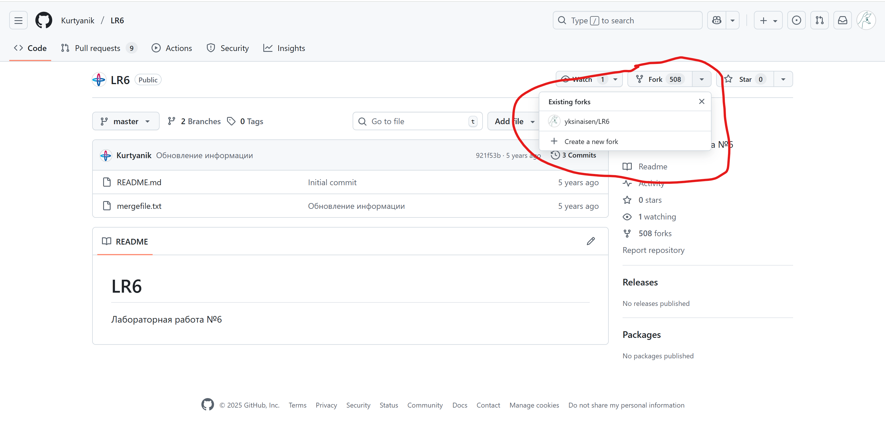

---

#### Пункт 3: Установка Git

Установлена система контроля версий Git с официального сайта.

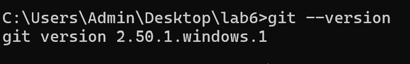

---

#### Пункт 4: Настройка Git

Настроены глобальные параметры пользователя:

```bash
git config --global user.name "P3112 Лубков Д.А."
git config --global user.email "lubkov.dima@gmail.com"
```

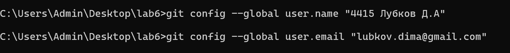

---

#### Пункт 5: Клонирование репозитория

Выполнено клонирование личного репозитория на локальную машину:

```bash
git clone https://github.com/yksinaisen/LR6.git
cd LR6
```

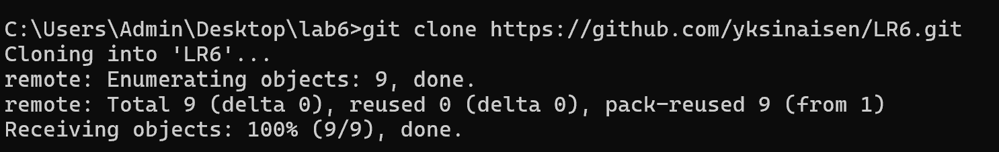

---

#### Пункт 6: Добавление файла через GitHub и Pull

Через веб-интерфейс GitHub создан файл `github_file.txt`, затем изменения подтянуты локально:

```bash
git pull origin main
```

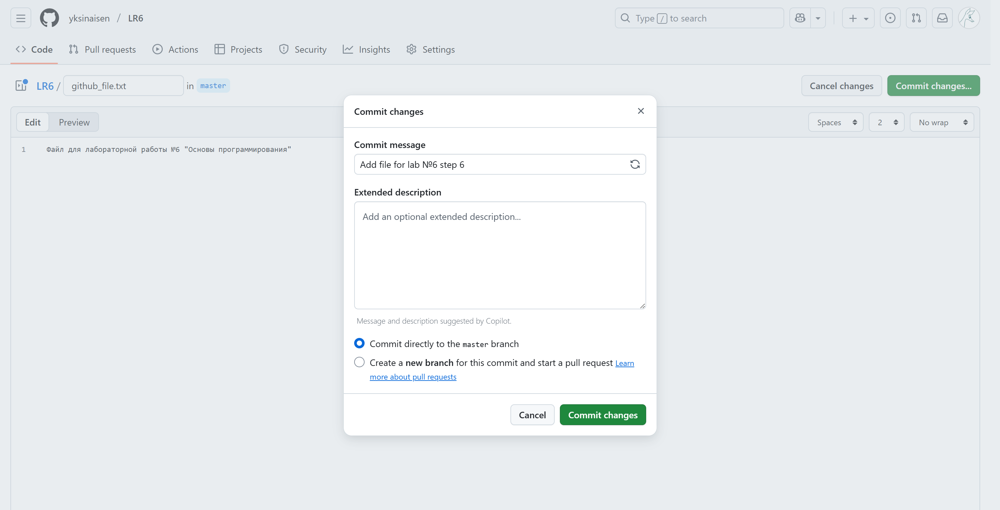  
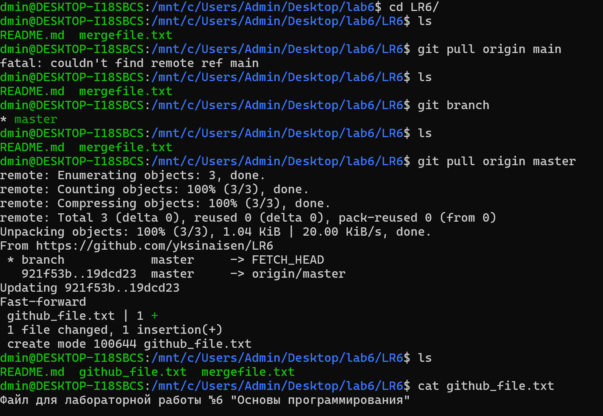

---

#### Пункт 7: История операций

Получена история коммитов для каждой ветки:

```bash
git log --oneline
```

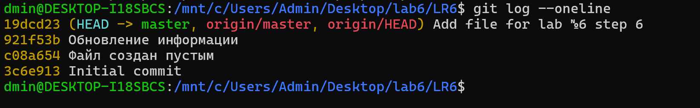

---

#### Пункт 8: Просмотр последних изменений

Просмотрены последние изменения с помощью команды:

```bash
git show
```

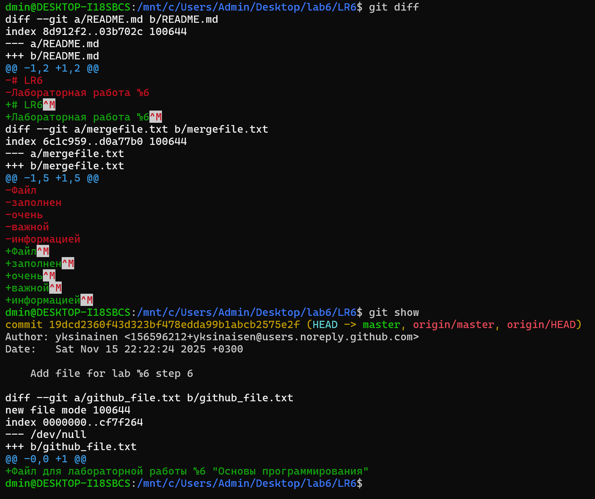

---

#### Пункт 9: Слияние с разрешением конфликта

Создана ситуация конфликта путем изменения одного файла в двух ветках. Конфликт успешно разрешен.

```bash
git merge conflict-branch
# Разрешение конфликта вручную
git add README.md
git commit -m "Разрешение конфликта слияния"
```

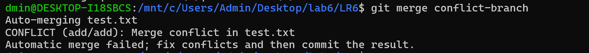  
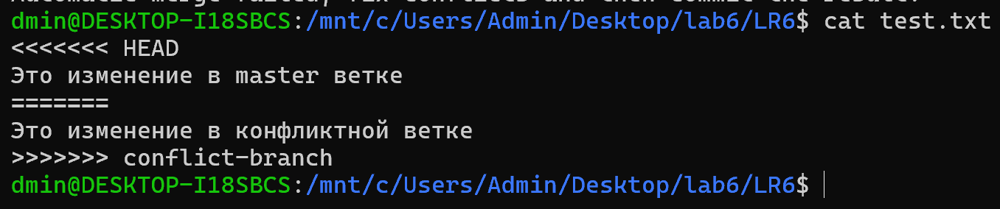 
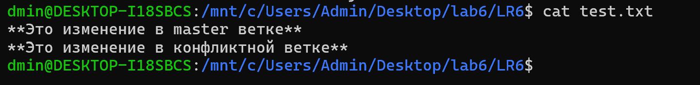 
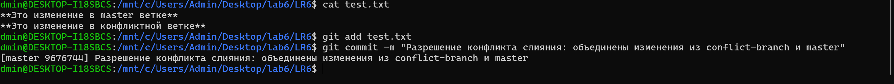

---

#### Пункт 10: Удаление побочной ветки

После успешного слияния ветка `conflict-branch` удалена:

```bash
git branch -d conflict-branch
```

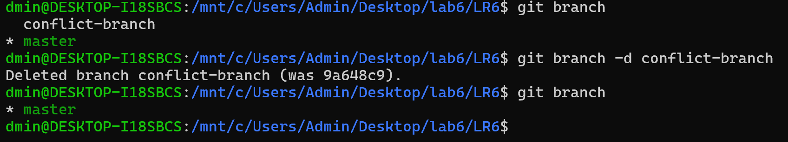

---

#### Пункт 11: Несколько коммитов

Выполнено несколько последовательных коммитов с разными файлами:

```bash
git add file1.txt
git commit -m "Первый коммит"

git add file2.txt
git commit -m "Второй коммит"
```

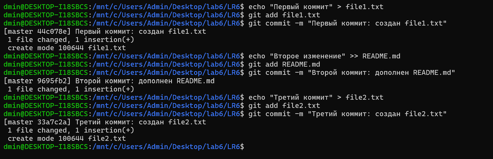

---

#### Пункт 12: Откат коммита

Выполнен откат коммита с помощью команды `git revert`:

```bash
git revert хэш_коммита
```


---

#### Пункт 13: Создание ветки для отчета

Создана отдельная ветка `report` для оформления отчета:

```bash
git checkout -b report
```

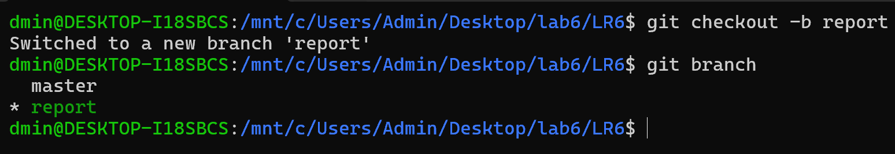

---

#### Пункт 14: Оформление отчёта в README.md

В ветке `report` оформлен отчёт о проделанной работе.

---

### Вывод

В ходе выполнения лабораторной работы мною были изучены базовые возможности системы контроля версий Git, выполнены некоторые операции с локальными и удалёнными репозиториями на платформе GitHub, а также отработаны навыки ветвления, слияния, разрешения конфликтов, просмотра истории изменений и отката коммитов.

---